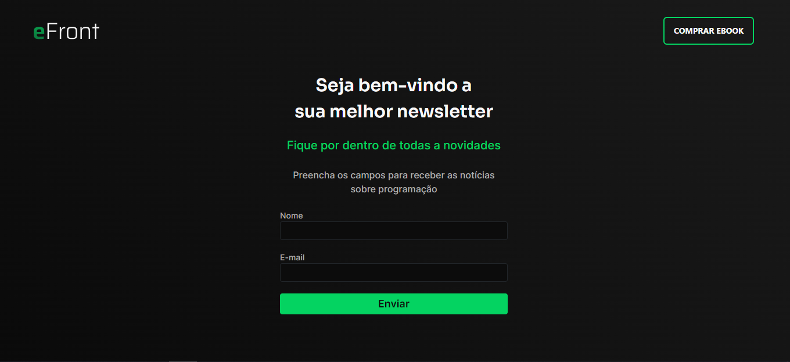

<h1 aling="left">eFront Form</h1>

- Desafio proposto pelo Iuri Code com o intuito de praticarmos a maioria dos conceitos apresentados durante seu Ebook.



<h2 aling="left">Ferramentas ⚙</h2>

<div aling="left">


</div>

<h2 aling="left"> Como Rodar o projeto</h2>

Clone o projeto com <code>git clone</code> :

```
git clone "aqui vai o link do repositório"
```

Clone o projeto ou baixe em sua máquina. Em sua maquina abra o repositório clonado ou baixado e digite no terminal <code>npm install</code> para instalar todas as dependencias :

```
npm install
```

Após isso digite em seu terminal <code>npm run dev</code> para rodar o servidor localmente :

```
npm run dev
```

---

### Link do site: https://efront-formulario.vercel.app/
